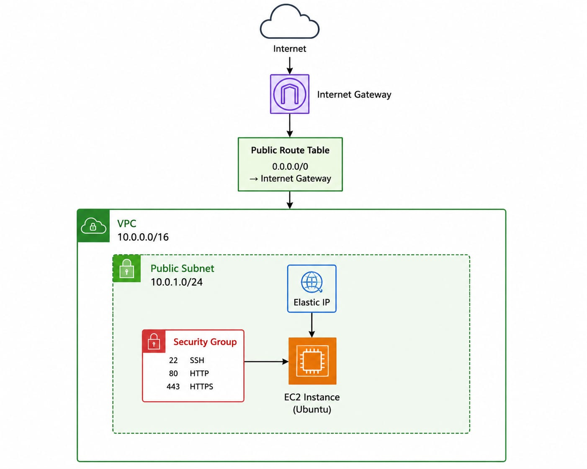
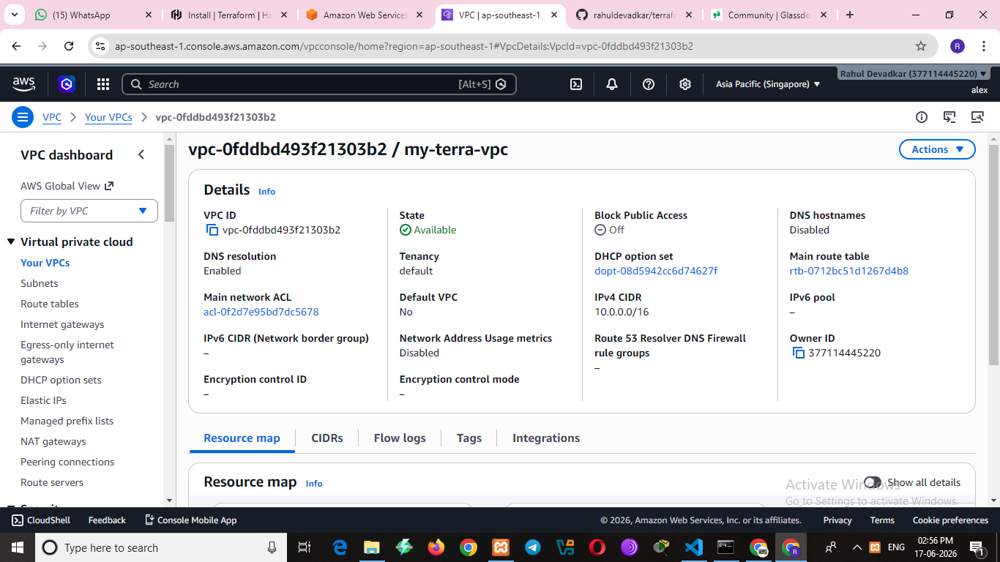
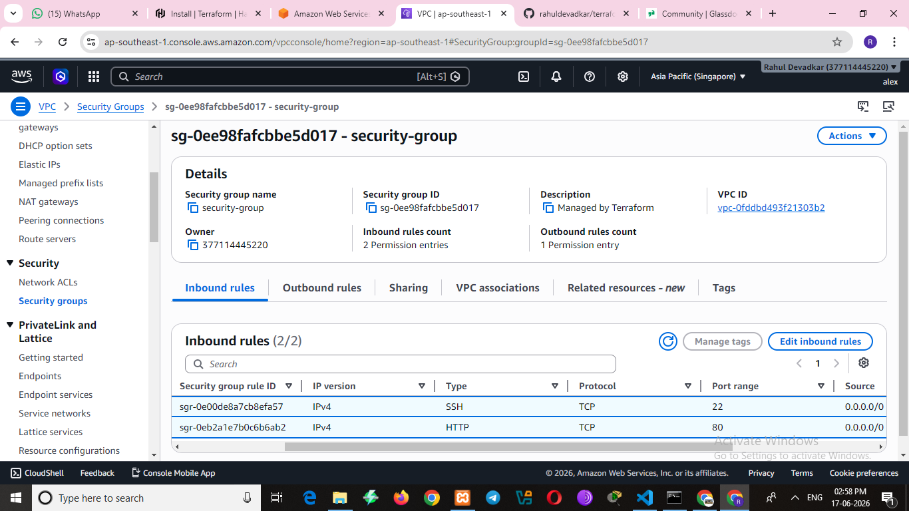
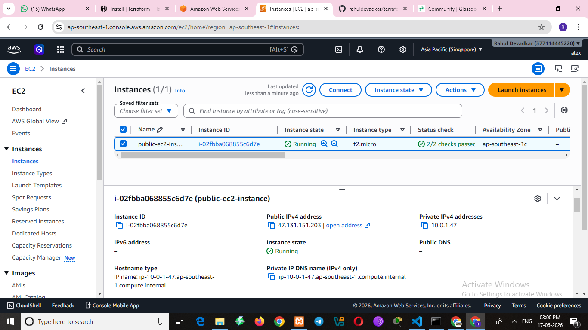
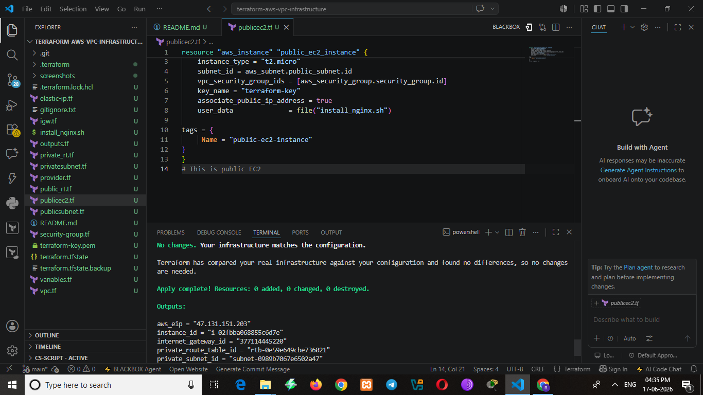

# 🚀 AWS VPC Infrastructure using Terraform

## 🌐 Live Demo : 13.250.75.158

## 📖 Project Overview

This project demonstrates how to provision AWS networking infrastructure using Terraform (Infrastructure as Code).

The infrastructure is deployed entirely through Terraform without manually creating resources in the AWS Console.

---

## 🏗️ Architecture

---

## ☁️ Resources Provisioned

✅ Amazon VPC

✅ Public Subnet

✅ Internet Gateway (IGW)

✅ Route Table

✅ Security Group

✅ Elastic IP (EIP)

✅ EC2 Instance

---

## 🛠️ Technologies Used

- Terraform
- AWS VPC
- Amazon EC2
- Elastic IP
- Security Groups
- AWS CLI
- Git & GitHub

---

## 📂 Project Structure

text
.
├── provider.tf
├── variables.tf
├── terraform.tfvars
├── vpc.tf
├── publicsubnet.tf
├── igw.tf
├── public_rt.tf
├── security-group.tf
├── publicec2.tf
├── outputs.tf
├── terraform.tfstate
└── screenshots/

---

## 📄 Terraform Files

| File | Purpose |
|--------|---------|
| 📌 provider.tf | AWS Provider Configuration |
| 📌 variables.tf | Input Variable Definitions |
| 📌 terraform.tfvars | Variable Values |
| 📌 vpc.tf | VPC Configuration |
| 📌 publicsubnet.tf | Public Subnet Configuration |
| 📌 igw.tf | Internet Gateway Configuration |
| 📌 public_rt.tf | Route Table Configuration |
| 📌 security-group.tf | Security Group Rules |
| 📌 publicec2.tf | EC2 Instance Creation |
| 📌 outputs.tf | Terraform Outputs |

---

## ⚙️ Terraform Commands Used

### Initialize Terraform

terraform init

### Validate Configuration

terraform validate

### Preview Infrastructure Changes

terraform plan

### Deploy Infrastructure

terraform apply

### Destroy Infrastructure

terraform destroy

---

## 🎯 Learning Outcomes

Through this project, I gained hands-on experience in:

- Infrastructure as Code (IaC)
- AWS VPC Networking
- Terraform Providers
- Terraform Variables
- Terraform State Management
- Public Subnet Deployment
- Security Group Configuration
- Elastic IP Association
- EC2 Provisioning
- Git & GitHub Version Control

---

## 📸 Project Screenshots

### 🌐 AWS Architecture Diagram

### VPC Dashboard

### Security Groups

### EC2 Instance

### ✅ Terraform Apply

---

## 🔮 Future Improvements

- Add Private Subnet
- Add NAT Gateway
- Deploy Multiple EC2 Instances
- Create Reusable Terraform Modules
- Store Terraform State Remotely in S3
- Implement Remote State Locking with DynamoDB

---

## 👨‍💻 Author

Rahul Devadkar

🌩️ Aspiring Cloud & DevOps Engineer

📚 Currently Learning:
- Terraform
- AWS
- Linux
- Networking
- Bash Scripting
- Python
- Git & GitHub
- DevOps Fundamentals

---

## ⭐ Support

If you found this project helpful, consider giving it a ⭐ on GitHub.
=======
# terraform-aws-vpc-infrastructure
AWS VPC Infrastructure using Terraform | VPC , Public Subnet, Internet Gateway, Route Table, Security Group, Elastic IP and EC2 Instance
